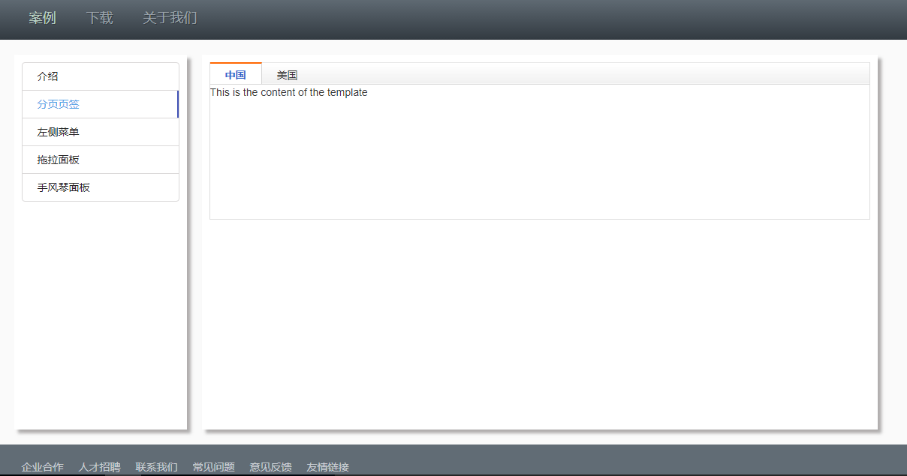

## angularjs-ey-ui
angularjs 实现网页版前端框架搭建，通过开发引入自定义指令及工具，及懒加载实现方式适合快速开发大型管理系统。

## 主要功能
> 菜单  
> 懒加载  
> 组件化  
> 路由切换菜单功能  

## 效果展示


## 技术栈
> [angularjs](https://cn.vuejs.org/) 是一款优秀的前端JS框架，有着诸多特性，最为核心的是：MVC、模块化、自动化双向数据绑定、语义化标签、依赖注入等。  

> [angular-ui-router](https://router.vuejs.org/zh-cn/) 它是一个第三方路由框架，允许通过状态机制组织接口，而不是简单的URL路由。  

> [require](https://www.npmjs.com/package/vue-resource) 实现js文件的异步加载以及管理模块之间的依赖性。  

> [ocLazyLoad](https://vuex.vuejs.org/zh-cn/) 通过 ocLazyLoad 实现动态（懒）加载模块和依赖。  

> [Angular directives for Bootstrap](http://angular-ui.github.io/bootstrap/) angularjs 第三方指令插件 （特别推荐的一款指令库）。 

## Build Setup
``` bash
# install dependencies
cnpm install

# serve with hot reload at localhost:8080
cnpm run server
```

## 项目组织架构
    app/  
        home/                      -->登录模块文件夹
            controllers/            -->控制器文件夹
            directives/             -->指令文件夹
            services/               -->服务文件夹 
        login/                      -->登录模块文件夹
            controllers/            -->控制器文件夹
            directives/             -->指令文件夹
            services/               -->服务文件夹   
    framework/                      -->主程序入口
    theme/
        css/                        -->项目的样式文件夹
        img/                        -->项目的图片文件夹    
    lib/                            -->项目使用的第三方库以及自定义库
    index.html                      -->应用的入口文件
    main.js                         -->加载语言等信息
